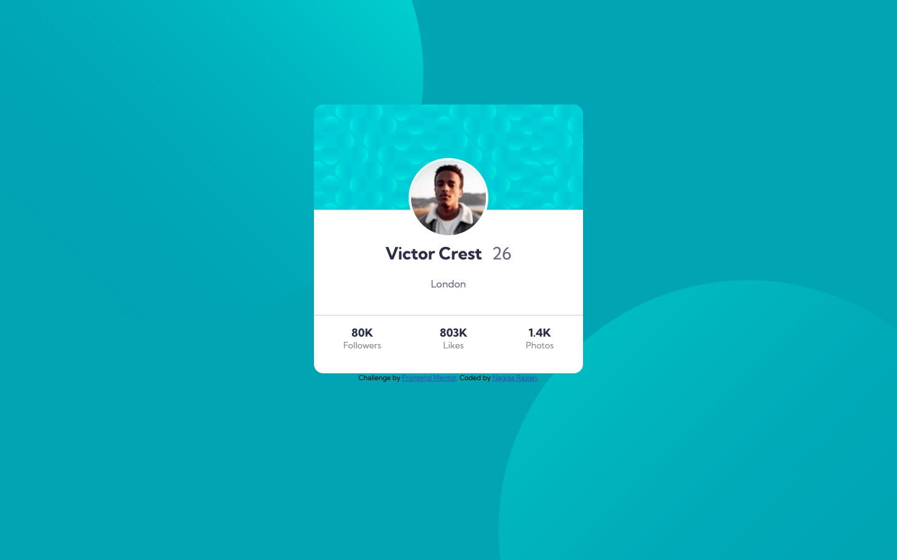
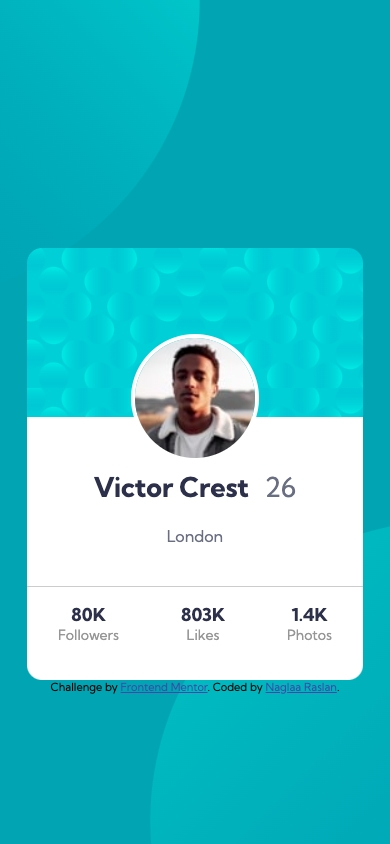

# Frontend Mentor - Profile card component solution

This is a solution to the [Profile card component challenge on Frontend Mentor](https://www.frontendmentor.io/challenges/profile-card-component-cfArpWshJ). Frontend Mentor challenges help you improve your coding skills by building realistic projects. 

## Table of contents

- [Overview](#overview)
  - [The challenge](#the-challenge)
  - [Screenshot](#screenshot)
  - [Links](#links)
- [My process](#my-process)
  - [Built with](#built-with)
  - [What I learned](#what-i-learned)
- [Author](#author)

**Note: Delete this note and update the table of contents based on what sections you keep.**

## Overview

### The challenge

- Build out the project to the designs provided

### Screenshot

- Desktop screenshot:
- Mobile screenshot:

### Links

- Solution URL: [Github repo](https://github.com/naglorias/profile-card.git)
- Live Site URL: [Live website](https://naglorias.github.io/profile-card/)

## My process

### Built with

- Semantic HTML5 markup
- CSS custom properties
- Flexbox
- Mobile-first workflow

**Note: These are just examples. Delete this note and replace the list above with your own choices**

### What I learned

- I learned to create a multiple backgrounds for my design.

**Note: Delete this note and the content within this section and replace with your own learnings.**

## Author

- Website - [Github profile](https://github.com/naglorias)
- Frontend Mentor - [@naglorias](https://www.frontendmentor.io/profile/naglorias)
- Twitter - [@naglaRn](https://twitter.com/naglaRn)

**Note: Delete this note and add/remove/edit lines above based on what links you'd like to share.**

